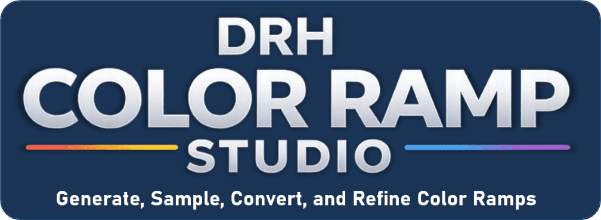
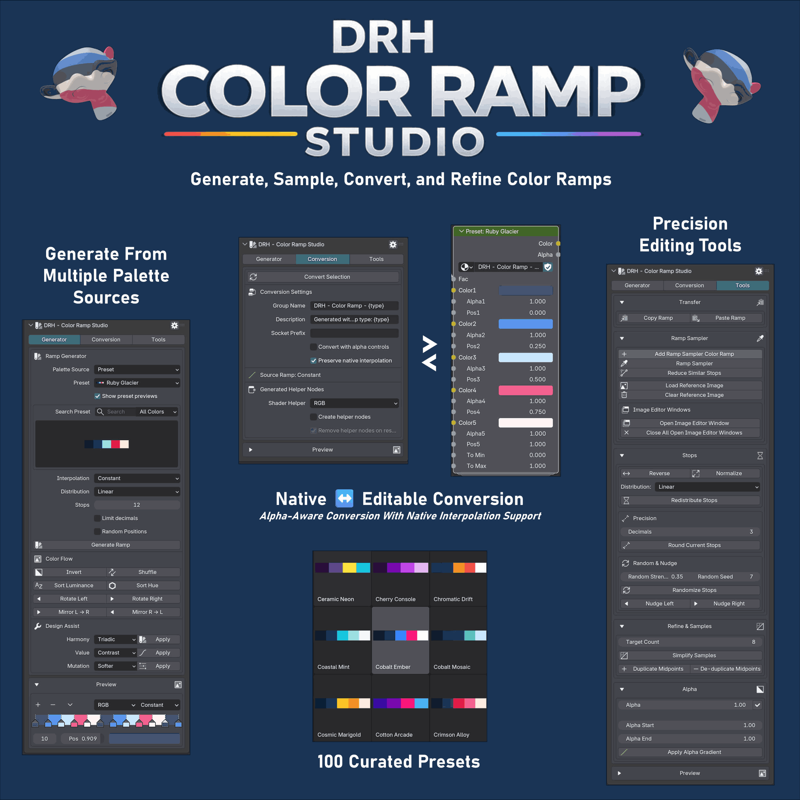
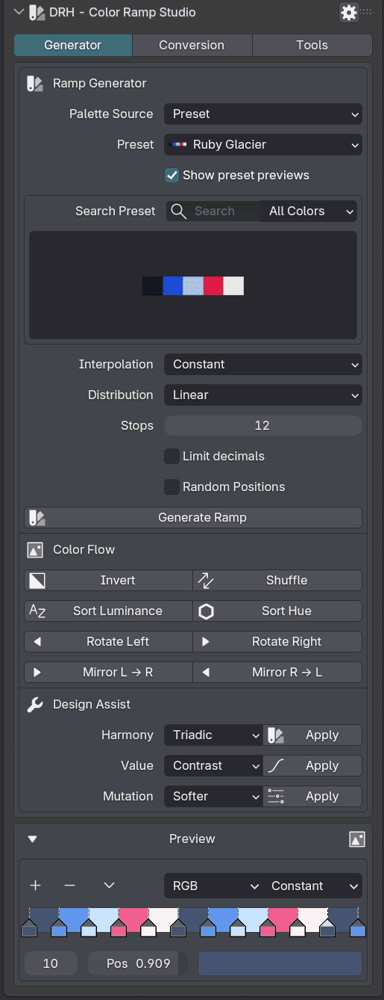
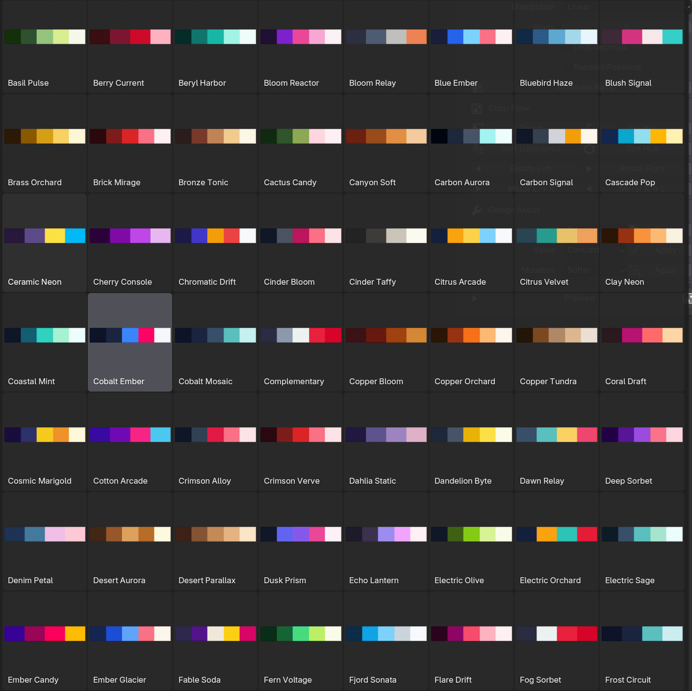
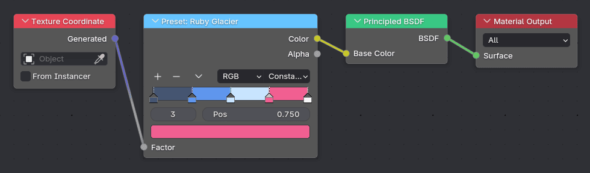
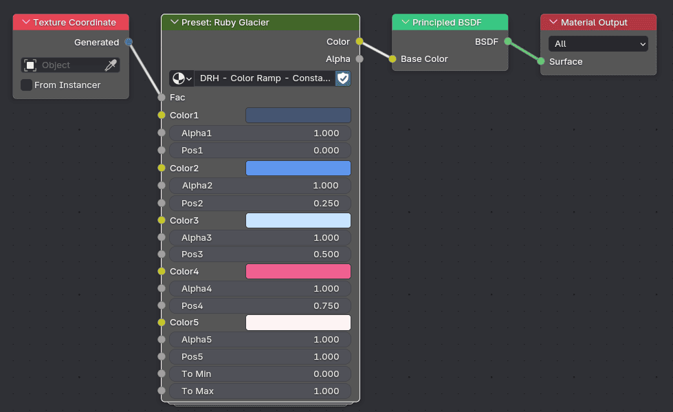
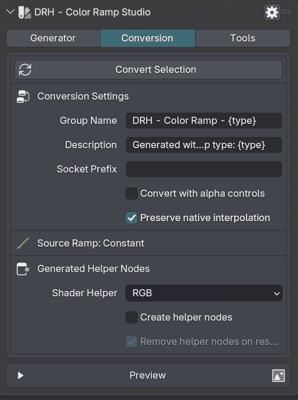
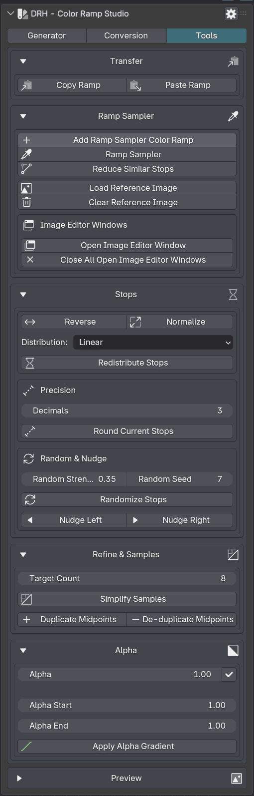
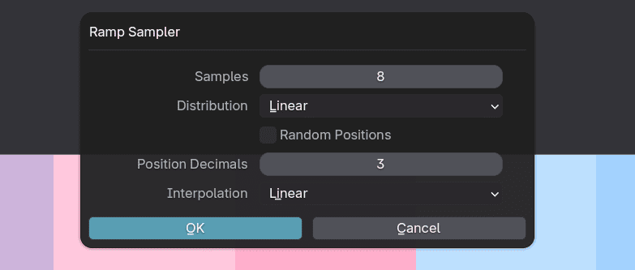
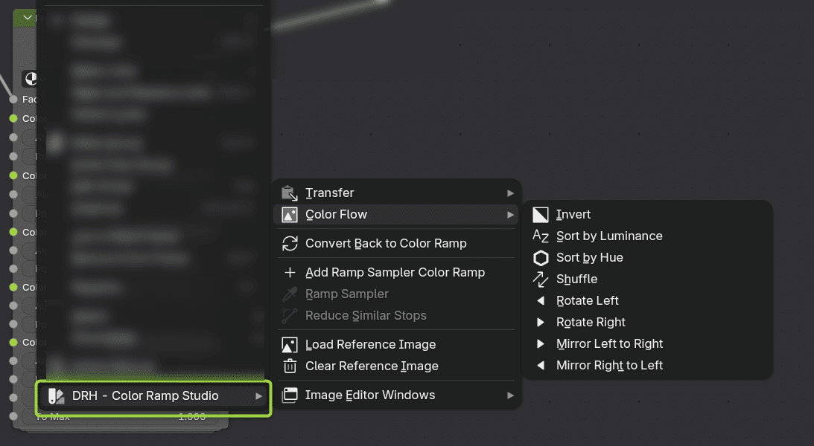

  

 

# DRH - Color Ramp Studio

### Public Support Hub · Documentation · Feedback · Pre-release Validation

**A Blender utility for creating, converting, sampling, refining, and managing Color Ramp workflows.**

 

**Part of the DRH Add-ons ecosystem — Blender tools, updates, and releases.**

<!--

-->

---

**DRH - Color Ramp Studio** helps Blender users build, sample, convert, organize, and refine Color Ramp setups more efficiently.

This repository is the central public hub for support, documentation, issue tracking, compatibility feedback, and community validation before marketplace release.

---

  
<strong>📚 Table of Contents</strong>

## Menu

- [Overview](#overview)
- [Media preview](#media-preview)
- [What DRH - Color Ramp Studio does](#what-color-ramp-studio-does)
- [Key features](#key-features)
- [Full feature list](#full-feature-list)
- [Who is it for?](#who-is-it-for)
- [Current status](#current-status)
- [Feedback wanted before release](#feedback-wanted-before-release)
- [Quick links](#quick-links)
- [Before you post](#before-you-post)
- [Where to post](#where-to-post)
- [Support policy](#support-policy)
- [Technical notes](#technical-notes)
- [Availability](#availability)
- [Documentation](#documentation)
- [License](#license)

---

## Overview

**DRH - Color Ramp Studio** is a Blender workflow utility designed to make Color Ramp creation, editing, conversion, sampling, and reuse easier across visual workflows.

It is intended for users who work with materials, shaders, procedural textures, Geometry Nodes, compositing, look development, gradients, palettes, and color-driven effects.

Instead of rebuilding ramps manually or losing useful color setups inside isolated node trees, DRH - Color Ramp Studio helps turn Color Ramp workflows into a more reusable, editable, and organized process.

## Media preview

  

<!--

---

### Demo video

Replace `YOUTUBE_VIDEO_ID` with your real YouTube video ID.

Example:
https://www.youtube.com/watch?v=YOUTUBE_VIDEO_ID

  
   
  Click the image to watch the demo on YouTube.

-->

<!--
### Quick demo GIF

Recommended size: 1280x720 or 960x540.

  

-->

### Screenshots

| Generator | Presets
|---|---|
|  | 

  
<strong>More Screenshots...</strong>

| Default Color Ramp | Node Conversion w/alpha |
|---|---|
|  | 

| Conversion | Tools | 
|---|---|
|  |  

| Ramp Sampler | Context Menu |
|---|---|
|  | 

  
<!--
Temporary placeholder while media is not available.

Media preview coming soon.

-->

---

## What DRH - Color Ramp Studio does

DRH - Color Ramp Studio helps you create, sample, convert, refine, restore, and transfer Color Ramp setups inside Blender.

It is not only a simple gradient preset tool. It is designed as a workflow helper for artists and technical users who rely on Color Ramps for materials, procedural effects, masks, stylized looks, terrain, particles, shader variation, and node-based color control.

Use it to:

- Create Color Ramp setups faster
- Generate useful ramp variations
- Sample colors from image-based sources
- Convert color information into usable ramps
- Refine ramp stops and color distribution
- Restore or reuse previous ramp setups
- Transfer Color Ramp data across supported workflows
- Improve shader, material, and procedural color workflows

---

### Key Features

- Image-to-ramp palette extraction for faster look development
- Non-destructive conversion of native ramps into editable advanced workflows
- Copy, paste, and transfer tools for reusing ramps across node setups
- Screen color sampling for palette capture directly from visual references
- Ramp cleanup and refinement tools for positions, colors, alpha, and distribution
- Restore tools for safe round-tripping after conversion
- Preset browser with previews, search, and color-family filtering
- Works across Shader Editor, Geometry Nodes, and Compositor

---

  
<strong>🧩 Full feature list</strong>

## Full feature list

### Ramp Generation

- Generate ramps from presets
- Generate ramps from images
- Generate ramps from complementary palettes
- Generate ramps from analogous palettes
- Generate ramps from greyscale palettes
- Generate ramps from random palettes
- Generate ramps from stripe palettes
- Adjustable stop count
- Interpolation controls
- Distribution controls
- Randomized stop positions
- Decimal limiting for stop positions

### Conversion & Restore

- Convert native Color Ramp nodes
- Build editable group-based ramp workflows
- Restore converted ramps
- Safe conversion flow
- Warning handling for lossy conversion cases
- Add Group Input links
- Expose ramp controls to group inputs

### Sampling & Image Workflows

- Extract palettes from image files
- Screen color sampler workflow
- Capture backend diagnostics
- Merge similar neighboring stops
- Load a reference image
- Clear the reference image
- Open an Image Editor workspace helper
- Close the temporary Image Editor helper

### Editing & Cleanup

- Copy ramp
- Paste ramp
- Redistribute stops
- Reverse stops
- Normalize stops
- Randomize stops
- Duplicate midpoints
- De-duplicate midpoints
- Simplify sampled stops
- Limit stop decimals
- Nudge stop positions
- Set uniform alpha
- Create alpha gradients

### Color Design Tools

- Invert colors
- Sort by luminance
- Sort by hue
- Mirror ramp colors
- Shuffle ramp colors
- Rotate ramp colors
- Shift color temperature
- Apply harmony modes
- Shape values for contrast
- Shape values for cinematic looks
- Shape values for pastel looks
- Shape values for deep-shadow looks
- Mutate palettes to softer variants
- Mutate palettes to darker variants
- Mutate palettes to vivid variants
- Mutate palettes to desaturated variants
- Mutate palettes with warm shifts
- Mutate palettes with cool shifts

### Smart Builders

- Highlights / Midtones / Shadows builder
- Terrain Mask builder
- Stylized Sky builder
- Heat Map builder
- Skin Tones builder

### Presets & Workflow

- Preset browser with thumbnail previews
- Search presets by name
- Filter presets by dominant color family
- Context-menu helpers
- Sidebar settings workflow
- Support for Shader Editor
- Support for Geometry Nodes
- Support for Compositor

---

## Who is it for?

DRH - Color Ramp Studio is designed for:

- Blender material artists
- Shader artists
- Procedural texture artists
- Geometry Nodes users
- Compositing users
- Look development artists
- Environment artists
- Stylized rendering artists
- Technical artists
- Asset creators
- Users who work frequently with gradients, palettes, masks, and color-driven node setups

---

## Current status

| Item | Details |
|---|---|
| **Status** | 🟠 Production Ready, Pending Approval |
| **Current version** | 1.0.0 |
| **Minimum Blender version** | 4.2.0 |
| **Platforms** | Windows, macOS, Linux |
| **Release type** | Preparing for public marketplace release |
| **Support repository** | [DRH - Color Ramp Studio Support](https://github.com/pacosalasv/DRH_Color_Ramp_Studio-Support) |

This add-on is production ready and currently pending marketplace approval. Compatibility feedback, usability comments, and workflow suggestions are welcome before public release.

---

## Feedback wanted before release

This repository is open for public feedback before marketplace release.

Feedback is especially welcome on:

- Feature usefulness
- Missing ramp workflow options
- Image sampling expectations
- Material and shader workflow needs
- Geometry Nodes or compositing use cases
- Compatibility concerns
- Installation experience
- Documentation clarity
- Expected pricing
- Marketplace expectations

Useful feedback examples:

> “I would use this to create ramps from reference images.”

> “This should support saving favorite ramp presets.”

> “I need a way to transfer ramps between materials.”

> “This would be useful if it works well with Geometry Nodes.”

> “The sampling workflow should include control over number of colors.”

---

## Quick links

- [Support repository](https://github.com/pacosalasv/DRH_Color_Ramp_Studio-Support)
- [Ask a question in Discussions](https://github.com/pacosalasv/DRH_Color_Ramp_Studio-Support/discussions)
- [Open a new issue](https://github.com/pacosalasv/DRH_Color_Ramp_Studio-Support/issues/new/choose)
- [Report a bug](https://github.com/pacosalasv/DRH_Color_Ramp_Studio-Support/issues/new?template=bug_report.yml)
- [Request a feature](https://github.com/pacosalasv/DRH_Color_Ramp_Studio-Support/issues/new?template=feature_request.yml)
- [Report a compatibility issue](https://github.com/pacosalasv/DRH_Color_Ramp_Studio-Support/issues/new?template=compatibility_issue.yml)

---

## Before you post

Please include as much of the following information as possible:

- Add-on version
- Blender version
- Operating system
- Installation method
- Clear steps to reproduce
- Expected result
- Actual result
- Error message, screenshot, or console output when available

For compatibility issues, please also include:

- Blender build type, if known
- Portable or installed Blender version
- Node editor context where the issue happened
- Whether the issue happens with a clean Blender configuration
- Whether the issue involves a specific image file, material, node tree, or scene setup

---

## Use Discussions for

- Questions
- How-to topics
- Installation help
- Compatibility checks
- FAQ
- Suggestions
- Pre-release feedback
- Pricing feedback
- Workflow ideas

---

## Use Issues for

- Confirmed bugs
- Reproducible compatibility problems
- Feature requests
- Regressions
- Marketplace or listing-related problems
- Documentation errors

---

## Where to post

Open a **Discussion** for:

- General questions
- Setup help
- Workflow advice
- Suggestions
- Early feedback

Open an **Issue** for:

- Confirmed bugs
- Reproducible compatibility problems
- Regressions
- Feature requests
- Documentation problems

---

## Support policy

This repository is a public support hub.

Do not post:

- Private account details
- License keys
- Payment information
- Confidential production files
- Private client files
- Sensitive system information

If a private file is required to reproduce an issue, please describe the problem first and wait for further instructions.

---

## Technical notes

This add-on is source based, with:

- No obfuscation
- No binary-only content
- No external services
- No account requirements

File access is only used to:

- Select image files for palette-based workflows

The add-on is intended to work locally inside Blender.

---

## Availability

This add-on may be available through multiple marketplaces and storefronts after release.

This GitHub repository remains the central public location for:

- Support
- Documentation
- Issue tracking
- Compatibility reports
- Public feedback
- Release notes

---

## Documentation

- [User Manual](docs/manual/user-manual.pdf)
- [Changelog](CHANGELOG.md)

---

## License

This repository is distributed under **GPL-3.0-or-later**.

---

### DRH Add-ons

**Blender tools, updates, and releases.**

Built for clean workflows, practical utilities, and production-friendly Blender setups.

