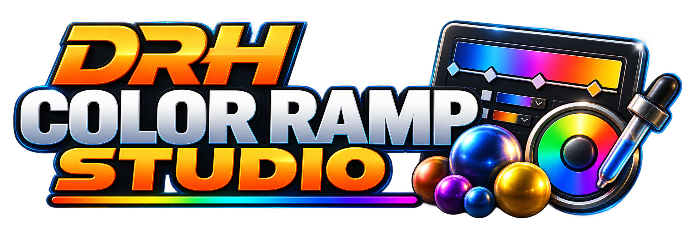
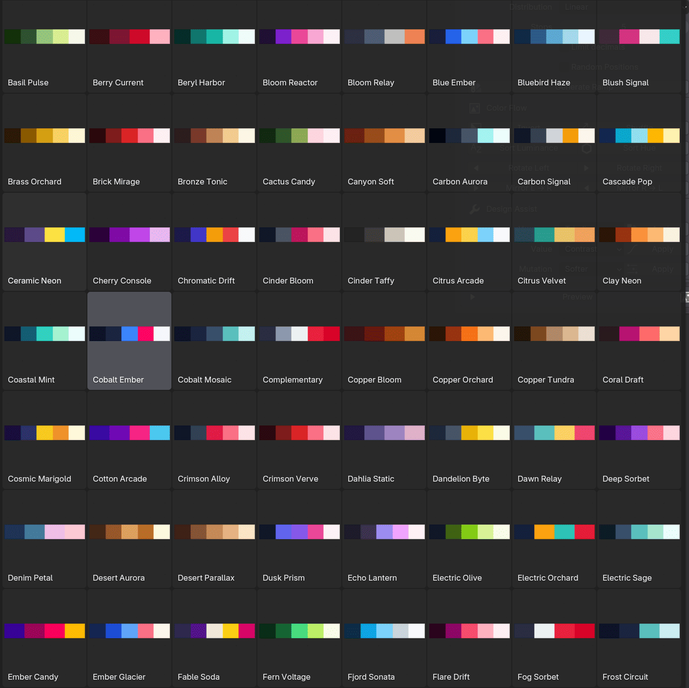
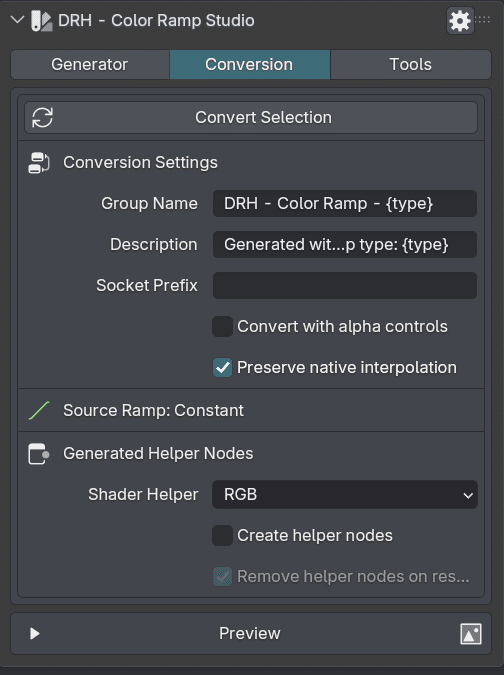
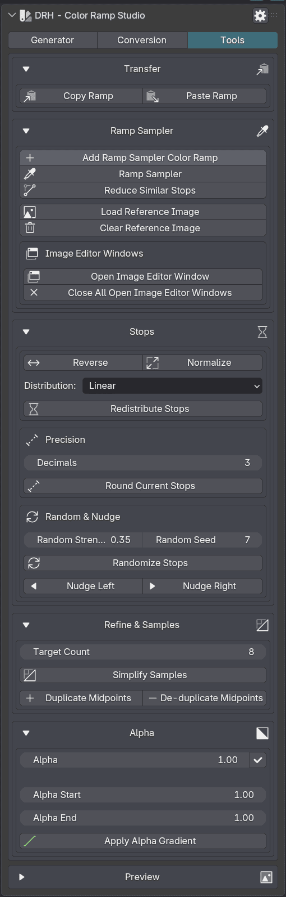
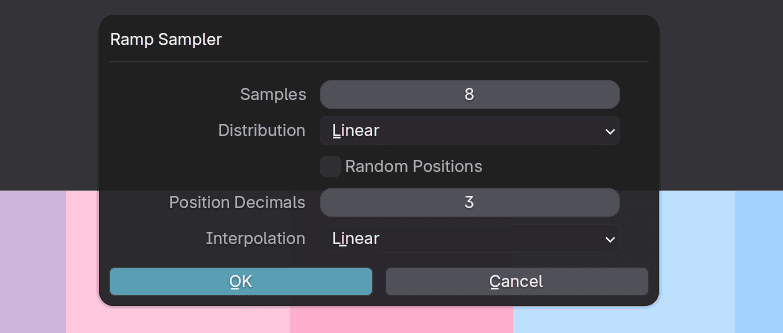

  

 

# DRH - Color Ramp Studio

### Support · Documentation · Feedback · Available on BlendKit

Color Ramp generation, conversion, sampling, and editing tools.

 

DRH Blender Tools: support, documentation, and release information.

---

DRH - Color Ramp Studio helps Blender users build, sample, convert, organize, and refine Color Ramp setups more efficiently.

This repository is the central public hub for support, documentation, issue tracking, compatibility feedback, and release feedback for DRH - Color Ramp Studio.

---

## Overview

DRH - Color Ramp Studio is a Blender workflow utility designed to make Color Ramp creation, editing, conversion, sampling, and reuse easier across visual workflows.

It is intended for users who work with materials, shaders, procedural textures, Geometry Nodes, compositing, look development, gradients, palettes, and color-driven effects.

Instead of rebuilding ramps manually or losing useful color setups inside isolated node trees, DRH - Color Ramp Studio helps turn Color Ramp workflows into a more reusable, editable, and organized process.

## Media preview

  

### Screenshots

| Generator | Presets |
|---|---|
|  |  |

  
<strong>More Screenshots...</strong>

| Default Color Ramp | Node Conversion w/alpha |
|---|---|
|  |  |

| Conversion | Tools |
|---|---|
|  |  |

| Ramp Sampler | Context Menu |
|---|---|
|  |  |

---

## What DRH - Color Ramp Studio does

DRH - Color Ramp Studio helps you create, sample, convert, refine, restore, and transfer Color Ramp setups inside Blender.

It is not only a simple gradient preset tool. It is designed as a workflow helper for artists and technical users who rely on Color Ramps for materials, procedural effects, masks, stylized looks, terrain, particles, shader variation, and node-based color control.

Use it to:

| Details |
|---|
| Create Color Ramp setups faster |
| Generate useful ramp variations |
| Sample colors from image-based sources |
| Convert color information into usable ramps |
| Refine ramp stops and color distribution |
| Restore or reuse previous ramp setups |
| Transfer Color Ramp data across supported workflows |
| Improve shader, material, and procedural color workflows |

---

## Capabilities

| Details |
|---|
| Image-to-ramp palette extraction for faster look development |
| Non-destructive conversion of native ramps into editable advanced workflows |
| Copy, paste, and transfer tools for reusing ramps across node setups |
| Screen color sampling for palette capture directly from visual references |
| Ramp cleanup and refinement tools for positions, colors, alpha, and distribution |
| Restore tools for safe round-tripping after conversion |
| Preset browser with previews, search, and color-family filtering |
| Works across Shader Editor, Geometry Nodes, and Compositor |

---

  
Feature reference

## Feature reference

### Ramp generation
| Details |
|---|
| Generate ramps from presets |
| Generate ramps from images |
| Generate ramps from complementary palettes |
| Generate ramps from analogous palettes |
| Generate ramps from greyscale palettes |
| Generate ramps from random palettes |
| Generate ramps from stripe palettes |
| Adjustable stop count |
| Interpolation controls |
| Distribution controls |
| Randomized stop positions |
| Decimal limiting for stop positions |

### Conversion and restore
| Details |
|---|
| Convert native Color Ramp nodes |
| Build editable group-based ramp workflows |
| Restore converted ramps |
| Safe conversion flow |
| Warning handling for lossy conversion cases |
| Add Group Input links |
| Expose ramp controls to group inputs |

### Sampling and image workflows
| Details |
|---|
| Extract palettes from image files |
| Screen color sampler workflow |
| Capture backend diagnostics |
| Merge similar neighboring stops |
| Load a reference image |
| Clear the reference image |
| Open an Image Editor workspace helper |
| Close the temporary Image Editor helper |

### Editing and cleanup
| Details |
|---|
| Copy ramp |
| Paste ramp |
| Redistribute stops |
| Reverse stops |
| Normalize stops |
| Randomize stops |
| Duplicate midpoints |
| De-duplicate midpoints |
| Simplify sampled stops |
| Limit stop decimals |
| Nudge stop positions |
| Set uniform alpha |
| Create alpha gradients |

### Color design tools
| Details |
|---|
| Invert colors |
| Sort by luminance |
| Sort by hue |
| Mirror ramp colors |
| Shuffle ramp colors |
| Rotate ramp colors |
| Shift color temperature |
| Apply harmony modes |
| Shape values for contrast |
| Shape values for cinematic looks |
| Shape values for pastel looks |
| Shape values for deep-shadow looks |
| Mutate palettes to softer variants |
| Mutate palettes to darker variants |
| Mutate palettes to vivid variants |
| Mutate palettes to desaturated variants |
| Mutate palettes with warm shifts |
| Mutate palettes with cool shifts |

### Smart builders
| Details |
|---|
| Highlights / Midtones / Shadows builder |
| Terrain Mask builder |
| Stylized Sky builder |
| Heat Map builder |
| Skin Tones builder |

### Presets and workflow
| Details |
|---|
| Preset browser with thumbnail previews |
| Search presets by name |
| Filter presets by dominant color family |
| Context-menu helpers |
| Sidebar settings workflow |
| Support for Shader Editor |
| Support for Geometry Nodes |
| Support for Compositor |

---

## Intended users

DRH - Color Ramp Studio is designed for:

| Details |
|---|
| Blender material artists |
| Shader artists |
| Procedural texture artists |
| Geometry Nodes users |
| Compositing users |
| Look development artists |
| Environment artists |
| Stylized rendering artists |
| Technical artists |
| Asset creators |
| Users who work frequently with gradients, palettes, masks, and color-driven node setups |

---

## Status

| Item | Details |
|---|---|
| Status | 🟢 Released |
| Current version | 1.0.0 |
| Minimum Blender version | 4.2.0 |
| Platforms | Windows, macOS, Linux |
| Release type | Free public release |
| Official distribution | BlendKit only |
| Free download on BlendKit | [DRH - Color Ramp Studio](https://www.blendkit.com/asset-gallery-detail/62ac725e-c55e-4e26-9e39-f6b81432d962/) |
| Support repository | [DRH - Color Ramp Studio Support](https://github.com/pacosalasv/DRH_Color_Ramp_Studio-Support) |

DRH - Color Ramp Studio is free for everyone. Official releases and installable packages are distributed exclusively through BlendKit. This GitHub repository is the public support and documentation hub; it does not host official release packages. Use it for compatibility feedback, bug reports, documentation, and workflow suggestions across supported Blender versions.

---

## Technical notes

This add-on is source based, with:

- No obfuscation
- No binary-only content
- No external services
- No account requirements

File access is only used to:

- Select image files for palette-based workflows

The add-on is intended to work locally inside Blender.

---

## Availability

DRH - Color Ramp Studio is free for everyone.

Official download and release distribution:

- [BlendKit - Free Download](https://www.blendkit.com/asset-gallery-detail/62ac725e-c55e-4e26-9e39-f6b81432d962/)

Official installable releases are distributed exclusively through BlendKit. This GitHub repository is intentionally kept as a support, documentation, feedback, and issue-tracking hub rather than a release-download mirror.

This GitHub repository remains the central public location for:

| Details |
|---|
| Support |
| Documentation |
| Issue tracking |
| Compatibility reports |
| Public feedback |
| Release notes |

---

## Documentation

- [User manual](docs/manual/user-manual.pdf)
- [Manual changelog](docs/manual/manual-changelog.md)
- [Product changelog](CHANGELOG.md)
- [Support guide](SUPPORT.md)

## Support

Use [GitHub Discussions](https://github.com/pacosalasv/DRH_Color_Ramp_Studio-Support/discussions) for setup questions, workflow guidance, usage help, and general feedback. Use [GitHub Issues](https://github.com/pacosalasv/DRH_Color_Ramp_Studio-Support/issues/new/choose) for reproducible bugs, regressions, compatibility problems, and focused feature requests.

See [SUPPORT.md](SUPPORT.md) for the shared DRH support format, the information to include in a report, and public-information guidance.

## Support DRH development

DRH development support is optional. Ko-fi contributions help cover maintenance, Blender compatibility work, documentation, testing, and continued development of free tools.

  

## Ecosystem links

- [DRH Add-ons Hub](https://github.com/pacosalasv/DRH_Addons_Hub)
- [BlendKit](https://www.blendkit.com/asset-gallery-detail/62ac725e-c55e-4e26-9e39-f6b81432d962/)
- [Paco Salas | DRH on GitHub](https://github.com/pacosalasv)
- [Ko-fi](https://ko-fi.com/pacosalasv)

## License

This repository is distributed under GPL-3.0-or-later. See [LICENSE](LICENSE).

---

Authored by Paco Salas | DRH.
