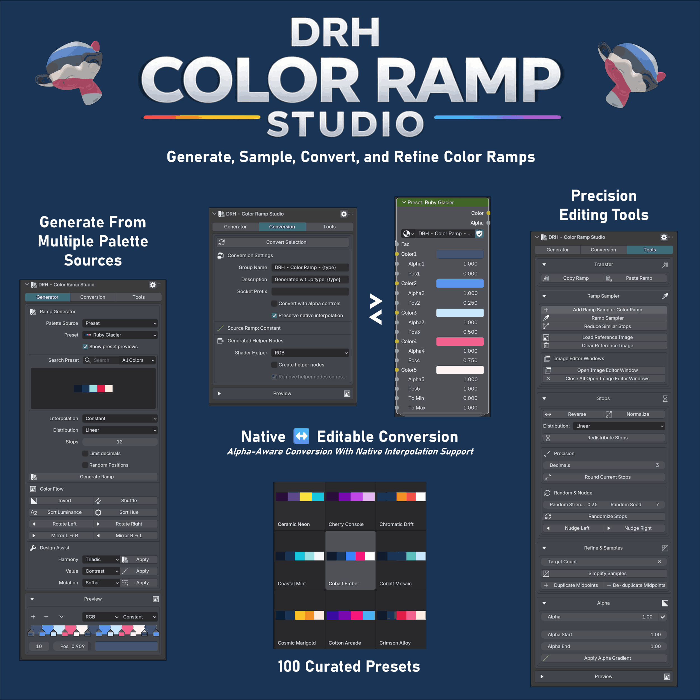
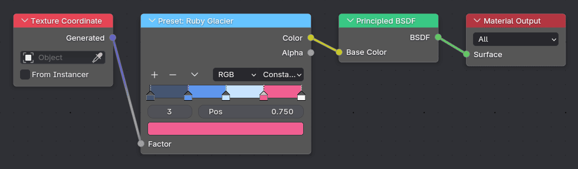
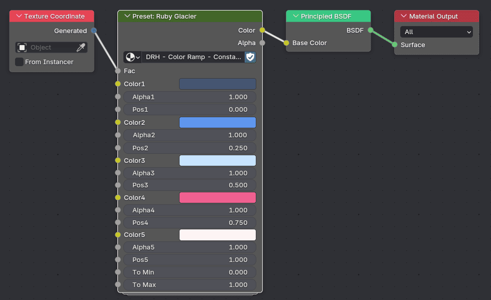
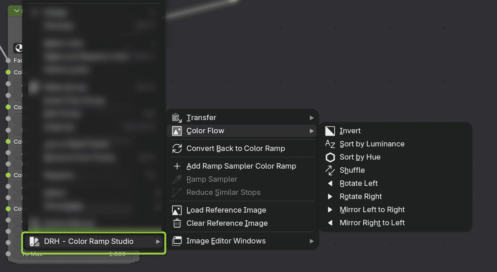
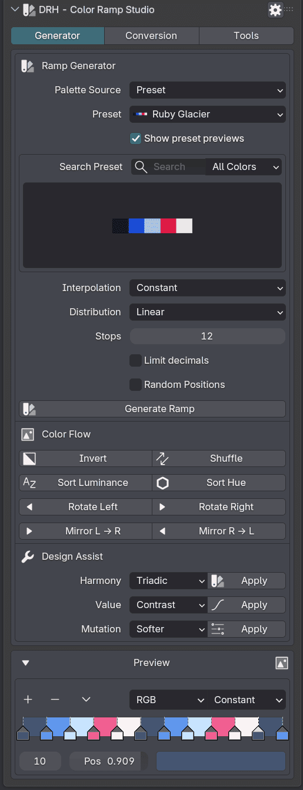

# DRH - Color Ramp Studio

**Create, sample, refine, convert, restore, and reuse Color Ramps faster across Blender**

   

  

---

## Overview

DRH - Color Ramp Studio is a focused Blender toolkit for building, sampling, converting, refining, and reusing Color Ramps across Shader Editor, Geometry Nodes, and Compositor workflows.

Version 1.1.0 strengthens color accuracy, preset discovery, image-palette extraction, conversion safety, and day-to-day ramp creation. The result is a faster path from a palette idea or visual reference to a usable Blender Color Ramp without giving up a practical route back to native nodes.

## Key features

| Capability | What it adds to the workflow |
|---|---|
| Curated preset library | Browse reusable ramps by category, text search, and dominant color family, including a dedicated Grayscale category. |
| Generate workflow | Create a Color Sampler workflow or prepare a Preset workflow from one clear entry point. |
| Image and screen sampling | Turn visual references into practical ramp starting points with safer image handling and bounded sampling. |
| Native conversion and restore | Convert Color Ramp nodes into editable group-based setups and restore them to native ramps when needed. |
| Color-aware editing | Perform hue, saturation, harmony, temperature-style, and palette mutations in an sRGB-aware workflow before values return to Blender linear RGB. |
| Ramp utilities | Copy, paste, reverse, normalize, redistribute, randomize, simplify, sort, mirror, rotate, nudge, and refine stops. |
| Alpha controls | Set uniform alpha, build alpha gradients, and preserve alpha-focused editing during conversion workflows. |
| Multi-editor support | Use the toolset across Shader Editor, Geometry Nodes, and Compositor contexts where supported node types are available. |

## What's new in 1.1.0

- Standardized preset, hex, screen-sampled, and image-sampled colors around an explicit sRGB-to-linear pipeline.
- Expanded preset discovery with category filtering that combines with text search and color-family filtering.
- Added a dedicated Grayscale preset category and refreshed preset curation to reduce visually redundant families.
- Improved the Generator flow so Preset mode prepares a native ramp and applies preset colors only when **Generate Ramp** is used.
- Places new ramps at the center of the visible Node Editor canvas instead of relying on the node cursor.
- Reworked image palette extraction to use an add-on-owned temporary image datablock and bounded pixel sampling.
- Made generated-group conversion cleanup transactional so failed conversions do not leave unwanted nodes or orphaned generated data.
- Preserved existing scene settings during registration and improved migration behavior for retired preset names.
- Namespaced generated runtime properties and improved diagnostics/logging for maintainability.

## Detailed features

Open detailed features

### Generation and presets

- Generate ramps from curated presets, images, complementary palettes, analogous palettes, grayscale palettes, random palettes, and stripe palettes.
- Adjust stop count, interpolation, distribution, randomized positions, and decimal precision.
- Combine preset text search, category filtering, and color-family filtering.
- Browse categories including Trending, Pastel, Dark, Vibrant, Earthy, Warm, Cool, Neutral, and Grayscale.
- Use thumbnail previews to compare palettes before applying them.

### Conversion and restore

- Convert native Color Ramp nodes into editable group-based workflows.
- Preserve restore metadata for a practical path back to a native Color Ramp.
- Expose ramp controls through group inputs when appropriate.
- Clean up temporary generated data when a conversion fails.
- Delay persistent/fake-user behavior until the conversion is ready to commit.

### Sampling and image workflows

- Extract palettes from image files.
- Sample gradients and colors from visual references.
- Merge similar neighboring stops.
- Use bounded image sampling instead of loading an entire pixel buffer into Python.
- Keep temporary image ownership isolated from existing user image datablocks.
- Use DRH ownership metadata for temporary sampler reference images.

### Editing and cleanup

- Copy and paste ramps.
- Redistribute, reverse, normalize, randomize, and nudge stop positions.
- Duplicate or de-duplicate midpoints.
- Simplify sampled stops and limit stop decimals.
- Set uniform alpha or create alpha gradients.

### Color design tools

- Invert colors.
- Sort by luminance or hue.
- Mirror, shuffle, and rotate ramp colors.
- Shift color temperature.
- Apply harmony modes.
- Shape value flow for contrast, cinematic, pastel, or deep-shadow looks.
- Mutate palettes into softer, darker, vivid, desaturated, warm, or cool variants.

## Product status

| Item | Details |
|---|---|
| Status | **Released** |
| Version | **1.1.0** |
| Blender | 4.2+ |
| Platforms | Windows, macOS, Linux |
| Availability | Free public release |
| Distribution | Official releases are distributed through the linked download page |
| Repository role | Documentation, support, issue tracking, compatibility feedback, and product feedback |

## Media

Product screenshots:

  
  
  
  

## Documentation and support

| Resource | Link |
|---|---|
| Support guide | [SUPPORT.md](SUPPORT.md) |
| User manual | [PDF manual](docs/manual/user-manual.pdf) |
| Repository changelog | [CHANGELOG.md](CHANGELOG.md) |
| Issues | [Open or review issues](https://github.com/pacosalasv/DRH_Color_Ramp_Studio-Support/issues) |
| Discussions | [Ask questions and share feedback](https://github.com/pacosalasv/DRH_Color_Ramp_Studio-Support/discussions) |

## Support development

Ko-fi support is optional. Contributions help fund maintenance, Blender compatibility work, documentation, testing, and continued development of free DRH tools.

  

## Ecosystem

| Destination | Link |
|---|---|
| Download | [Official product page](https://www.blendkit.com/asset-gallery-detail/62ac725e-c55e-4e26-9e39-f6b81432d962/) |
| Support development | [Ko-fi](https://ko-fi.com/pacosalasv) |
| Issues & feedback | [GitHub Issues](https://github.com/pacosalasv/DRH_Color_Ramp_Studio-Support/issues) |
| DRH Add-ons Hub | [Catalog and roadmap](https://github.com/pacosalasv/DRH_Addons_Hub) |
| BlendKit | [DRH Blender catalog](https://www.blendkit.com/?query=author_id:205846) |
| Paco Salas \| DRH | [Official site](https://pacosalasv.blogspot.com/) |
| Xtreme Mindset | [Product lab](https://xtrememindset.blogspot.com/) |
| Sketchfab / Código Píxel | [3D model collections](https://sketchfab.com/codigopixel/collections) |
| KreaOn | [Technology education](https://www.kreaon.com/) |
| PiNu | [Connected physical products](https://pinu.com.mx/) |
| GitHub | [pacosalasv](https://github.com/pacosalasv) |

## License

See [LICENSE](LICENSE) for repository licensing terms.
